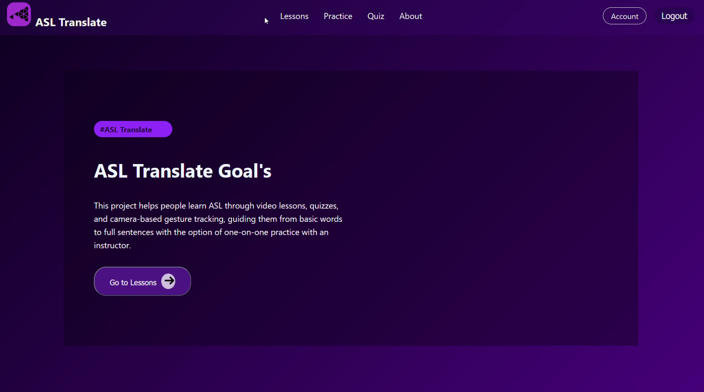
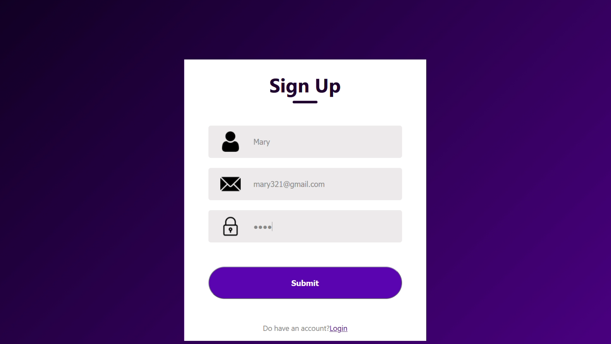
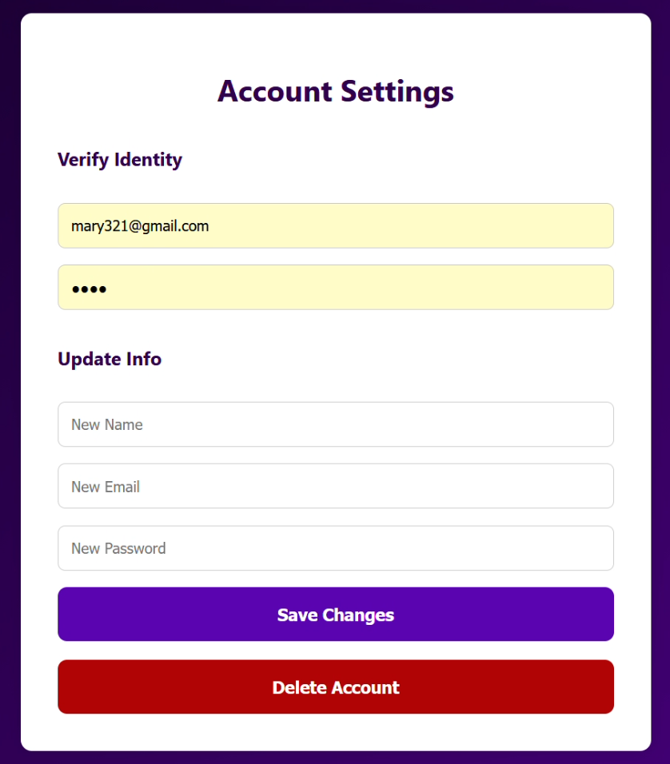
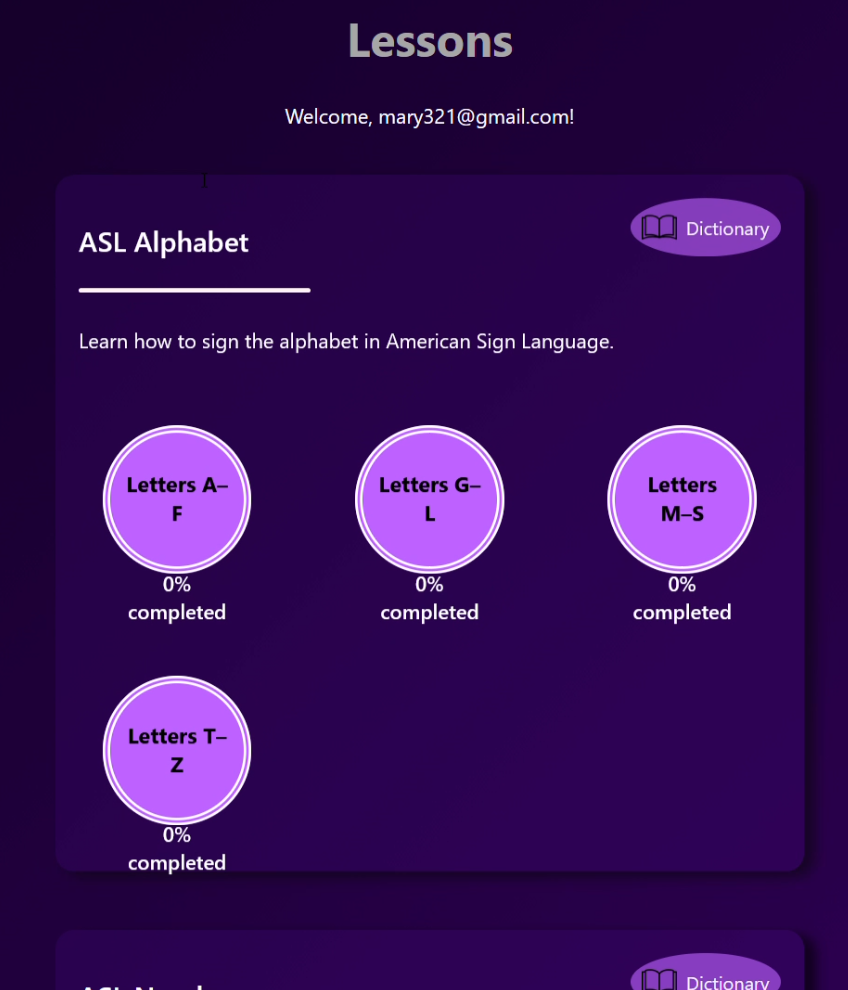
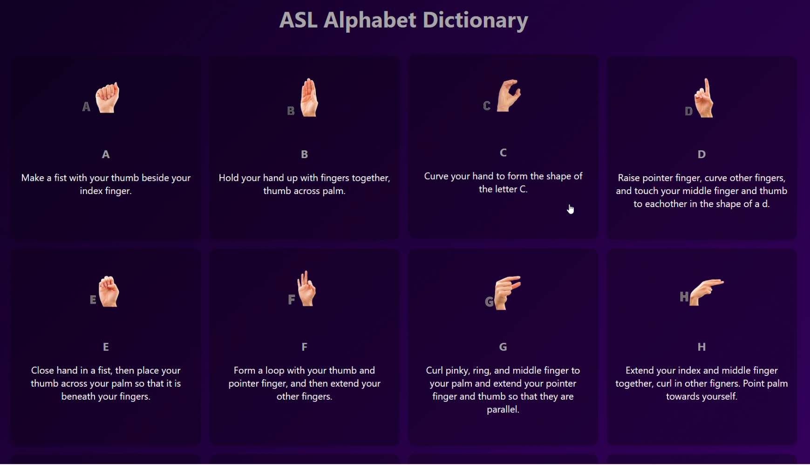
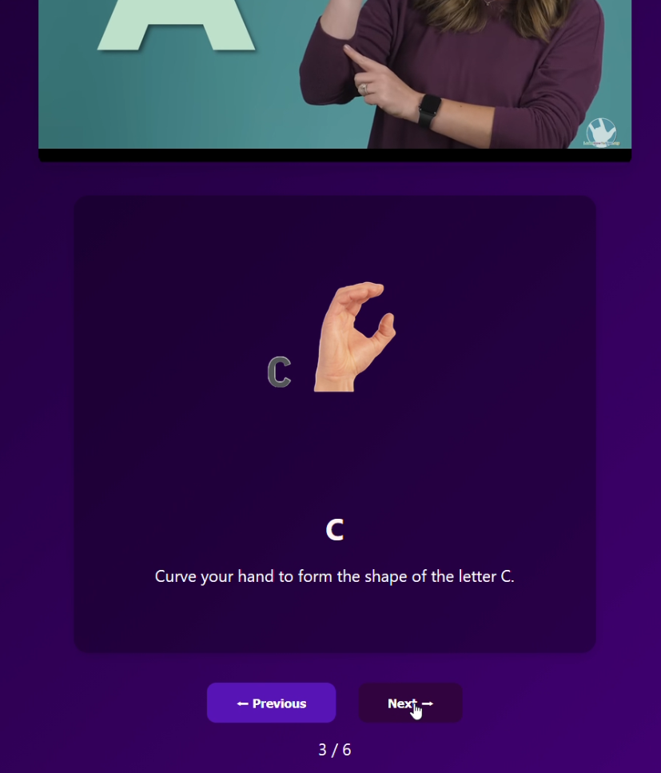
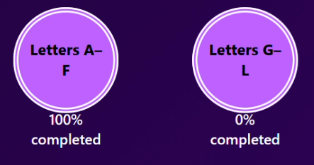
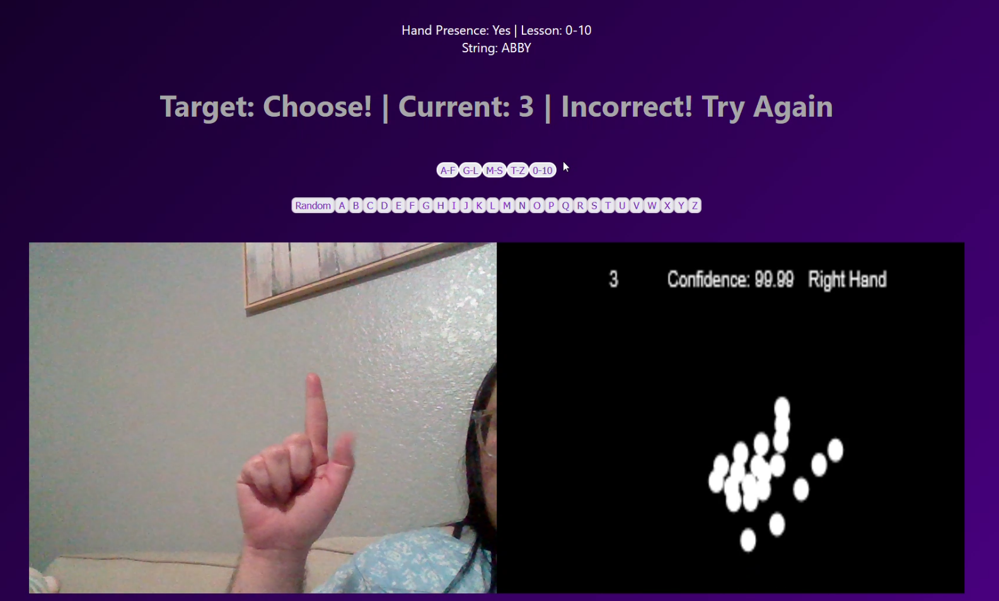
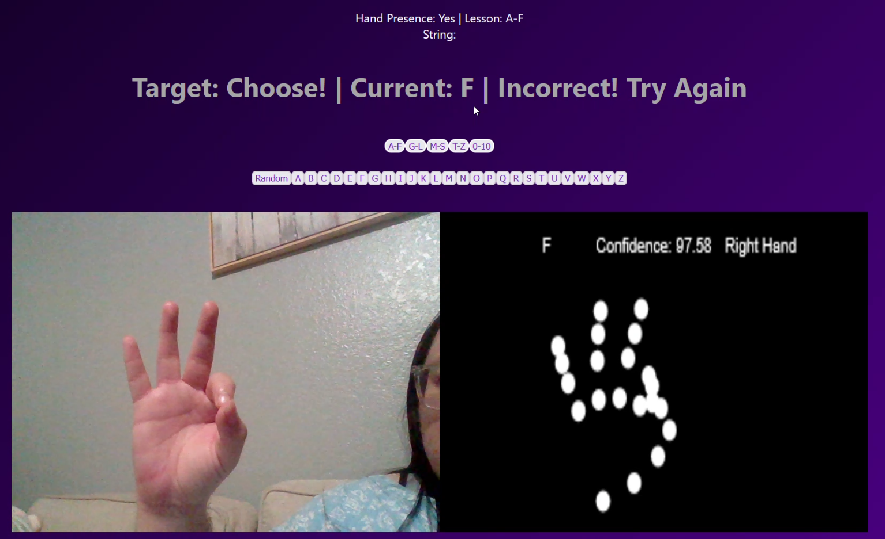
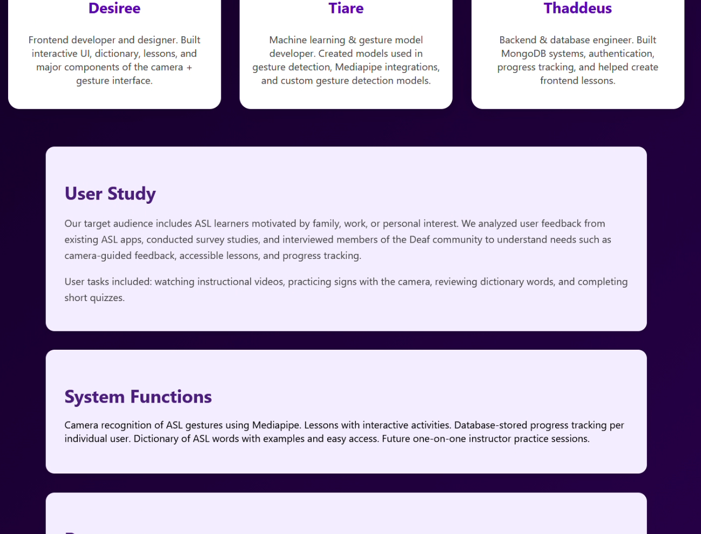

# Asl-translation-
# Welcome to the Asl-translation- wiki!

To do this project, we're going to be dividing the work into 4 sprints. In the first sprint, we're going to focus on the website for the first lesson and camera input with body detection. Then we can begin developments to input the ASL. The second sprint will be to finish the first lesson with the ABCs, that is letters without motion, then develop the motion capture of ASL to do some words with the hand fingers. Third sprint is about adding near face motion and adding a new lesson for the new words that we can do. Fourth sprint is adding any more words or lessons that we want to make and adding a feature for meeting with a professional for a one-on-one practice to practice sign language that they know when the user is more intermediate to advanced level.  

# Demonstration

# Example Images

 

 

📂 Project Structure

    /backend/               ← Backend server (Express, Mongoose)
        /mongo.js           ← MongoDB connection and Schema
        /server.js          ← Backend server (Express)
        /package.json       ← Backend dependencies
     /client/               ← React frontend
       /src/                ← React components
            /assets         ← Images and icons
            /components     ← Navbar & Elements 
            /context        ← Authorized the email
            /data           ← Lesson data
            /pages/         ← Pages in React
                /style      ← Pages css
                /taskModels ← Hand Models
       /public              ← Static files
           /sign            ← Photos in lesson
       /package.json        ← Frontend dependencies

# How to set up

## Node.js
    cd backend
    npm install
    npm install mongoose

## React
    cd client
    npm install
    npm install react-script

## run backend
    file location \GitHub\Asl-translation-\backend>
    node server.js

    should see if no error
        Backend will run at: http://localhost:5000

## run frontend
    cd client
    file location \GitHub\Asl-translation-\client>
    npm start

    should see if no error
        Frontend will run at: http://localhost:3000

